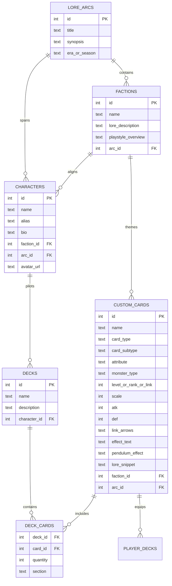

# 🗄️ Authoritative Database & Data Architecture Subsystem (`data/authoritative/`)

This directory contains the SQLite relational database definitions, Full-Text Search (FTS5) virtual tables, and bootstrapping seed scripts for the Yu-Gi-Oh! custom card, story lore, and duelist progression engine.

---

## 📁 Database Files & Schemas

| File | Purpose | Notes |
| :--- | :--- | :--- |
| [`schema.sql`](file:///home/professorseanex/yugioh-server/data/authoritative/schema.sql) | Master unified SQLite DDL schema | Complete 17 relational tables + FTS5 |
| [`schema_content.sql`](file:///home/professorseanex/yugioh-server/data/authoritative/schema_content.sql) | Static authored content DDL schema | 11 tables: cards, decks, lore, chapters, stages, duel_logs |
| [`schema_telemetry.sql`](file:///home/professorseanex/yugioh-server/data/authoritative/schema_telemetry.sql) | Dynamic telemetry DDL schema | 6 tables: ratings, matches, usage stats, player decks, progress |
| [`seed_databases.py`](file:///home/professorseanex/yugioh-server/data/authoritative/seed_databases.py) | Bootstrapping seed & sync pipeline | Synchronizes content and telemetry databases |

The live database files are maintained at:

- **`data/authoritative/content.db`** (Static Authored Game Content)
- **`data/telemetry/telemetry.db`** (Dynamic Player Telemetry & Match History)

---

## 🏛️ Relational Schema Design



---

## 🔍 Full-Text Search (FTS5)

To provide lightning-fast card searching across card names, archetypes, and effect text (for both the Web Catalog and Discord `/search` slash commands), the schema creates an SQLite FTS5 virtual table:

```sql
CREATE VIRTUAL TABLE IF NOT EXISTS custom_cards_fts USING fts5(
    name,
    effect_text,
    card_type,
    card_subtype,
    attribute,
    monster_type,
    content='custom_cards',
    content_rowid='id'
);
```

Automated SQLite triggers keep the search index synchronized whenever cards are inserted, updated, or deleted.

---

## 🚀 Initializing & Seeding the Database

To create the tables and seed default data:

```bash
# Direct Python execution:
python3 data/authoritative/seed_databases.py

# Via Master CLI (sync also compiles CDB and Lua):
./manage.sh sync
```
